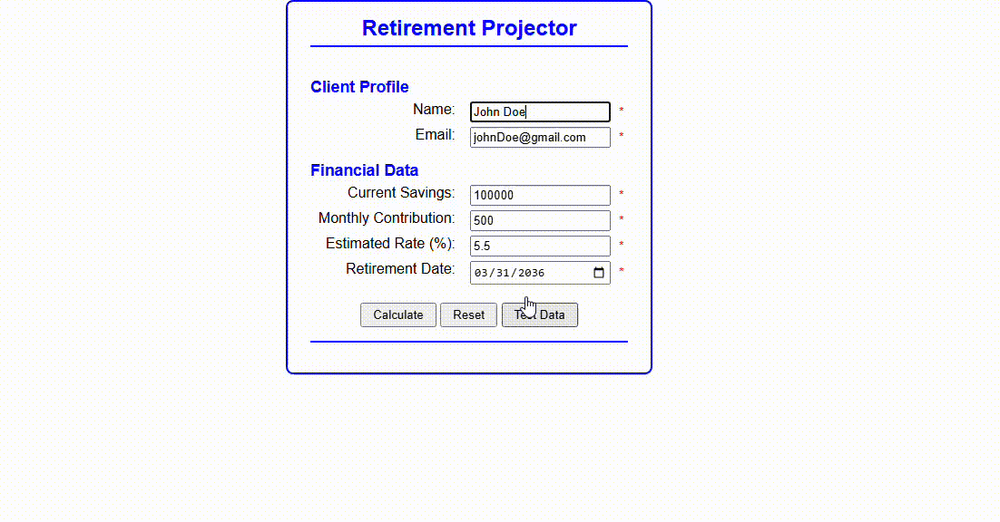

# Retirement Countdown

## Output

## Table of Contents
* [Authors](#authors)
* [Purpose](#purpose)
* [Script Breakdown](#script-breakdown)
* [New Concepts Used](#new-concepts)
* [Output](#output)
* [Credits](#credits)

## Authors
* [Violet French](https://github.com/Pirategirl9000)
* [Kyler Hanson](https://github.com/kyhans07)

## Purpose
The purpose of this program is to take in information about the user's financials (savings balance, monthly savings additions, interest rate) and information about the person (name, email) and the date they want to retire. It then uses this data to determine what the projected income of the user will be based on their financials on their projected retirement date

## Script Breakdown
### Important Globals
* `projectionTimer` - The id of the interval object used to calcualte the yearly projections
* `formatter` - An IntL number formatter set up to convert a number to US formatted currency

### Functions and Listeners
* 

## New Concepts
* Date Manipulation
* Intervals
* Regex & Data Validation
* Error Creation and Handling
* Regional Money Formatting

## Credits
###### This is an adaptation of a script provided by [Debbie Johnson](https://github.com/dejohns02)
